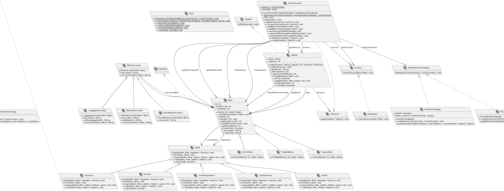
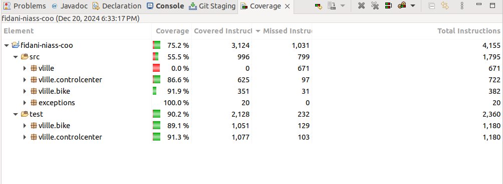

# PROJET COO 2024 - simulation Location Vlille

## binôme : 
 - HOUSSAM-EDDINE FIDANI
 - El-Hadji-Saliou Niass

### Description du Projet :
Le projet Vlille est une implémentation en Java d'un système de partage de vélos, conçu pour gérer et simuler les opérations d'un service de partage de vélos. Il comprend des fonctionnalités pour la gestion des différents états des vélos, la gestion des stations, les routines de service, et une simulation des interactions des utilisateurs avec le système.

### Tâches Accomplies :

 - [x] UML réalisé
 - [x] Classes 
 - [x] Tests 
 - [x] Main

## HowTo :

### UML
.

### 
.
### Récupération du code source :
1. Placez-vous dans le répertoire où vous souhaitez cloner le projet 
2. $ git clone https://gitlab-etu.fil.univ-lille.fr/houssameddine.fidani.etu/fidani-niass-coo.git

### Générez la documentation : 
1. Placez-vous dans la racine du projet cloné (pour toutes les autres commandes également)
2. make javadoc

### Compiler et exécuter les sources : 
make run

### Compilation des tests :
make test-classes 

### Execution des tests :

make test

### Génerer la javadoc : 
make javadoc

### Générer et exécuter l’archive (.jar) du projet : 
make jar

### **Conception du Projet**

Le projet suit une conception orientée objet avancée avec une attention particulière à la modularité, la flexibilité, et l'extensibilité. Voici les principaux éléments de conception et les design patterns utilisés :

---

#### **1. Architecture Modulaire**  
Le projet est structuré en plusieurs classes responsables de leurs propres fonctionnalités :  
- `Bike` représente les vélos avec leurs caractéristiques et leurs états.  
- `Station` gère les vélos associés à une station spécifique, incluant la capacité de la station et la disponibilité des vélos.  
- `ControlCenter` agit comme une entité centrale pour coordonner et superviser l'état global du système, notamment la gestion des stations et des vélos.

Cette architecture modulaire suit le principe de **séparation des responsabilités** (SRP) et facilite la maintenance et l'extension du projet.

---

#### **2. Singleton dans `ControlCenter`**  
La classe `ControlCenter` utilise le **design pattern Singleton** pour garantir une instance unique dans l'application.  
- Ce choix assure une centralisation des données et des opérations, évitant la duplication des informations liées aux stations et vélos.
- L'instance unique est accessible globalement, permettant une gestion cohérente des interactions entre stations et vélos.

---

#### **3. Modèle Stratégie (Strategy Pattern)**  
Le **design pattern Strategy** est utilisé pour personnaliser les algorithmes de redistribution des vélos entre les stations :
- Des implémentations comme `RandomStrategy` et `RoundRobinStrategy` permettent de modifier dynamiquement le comportement du système sans altérer le code client.
- Ce modèle garantit une **flexibilité** pour intégrer de nouvelles stratégies de redistribution en ajoutant simplement des classes qui implémentent l'interface commune.

---

#### **4. Composite dans la Modélisation des Stations et du Centre de Contrôle**  
Le **design pattern Composite** est utilisé pour structurer les relations hiérarchiques entre :
- `ControlCenter`, composé d'une collection de stations (`Station`).
- `Station`, qui à son tour est composée de vélos (`Bike`).

Ce modèle permet de traiter de manière uniforme les stations et les vélos, facilitant les opérations sur des collections complexes.

---

#### **5. État (State Pattern) dans la Gestion des Vélos**  
Le **design pattern State** est employé pour gérer les différents états d'un vélo, comme :  
- `InService` : Le vélo est disponible pour être loué.  
- `OutOfService` : Le vélo nécessite une réparation et ne peut pas être utilisé.  
- `Rented` : Le vélo est actuellement loué.  

Chaque état est encapsulé dans une classe dédiée, rendant le code extensible et évitant les conditions complexes liées aux états dans la classe `Bike`.

---

#### **6. Décorateur (Decorator Pattern)**  
Le **design pattern Décorateur** est utilisé pour étendre les fonctionnalités des vélos sans modifier leurs classes de base :  
- Par exemple, ElectricBike pourrait être une extension décorative d'un vélo classique (ClassicBike) pour y ajouter des fonctionnalités spécifiques.

Ce modèle favorise la **réutilisation du code** et la personnalisation des comportements.

---

#### **7. Observateur (Observer Pattern)**  
Le **design pattern Observer** est intégré pour gérer les notifications entre les objets :  
- Les stations (`Station`) ou le centre de contrôle (`ControlCenter`) peuvent notifier les vélos ou d'autres entités en cas de changement d'état.
- Cela permet une mise à jour dynamique et synchronisée des composants, garantissant la cohérence du système.

---

Cette conception démontre un respect des principes SOLID, favorisant un système robuste, maintenable et évolutif.

 

